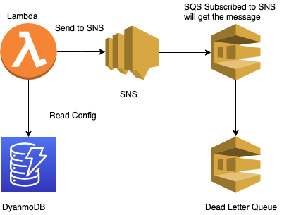

# AWS SNS SQS

Send an event to a lambda launcher. Then that launcher will trigger another lambda which put things to 
SNS. A SQS is subscribed to it. which will be populated as soon as there is a message to SNS.

## Architecture

## Deployment:

1. make deploy_sns
2. make deploy_sqs
3. make install
4. make validate_config
5. make deploy_config
6. make deploy_serverless

TODO: Write tests with jest. Integration and unit. Using docker image
TODO: Add a tracker dynamodb table
